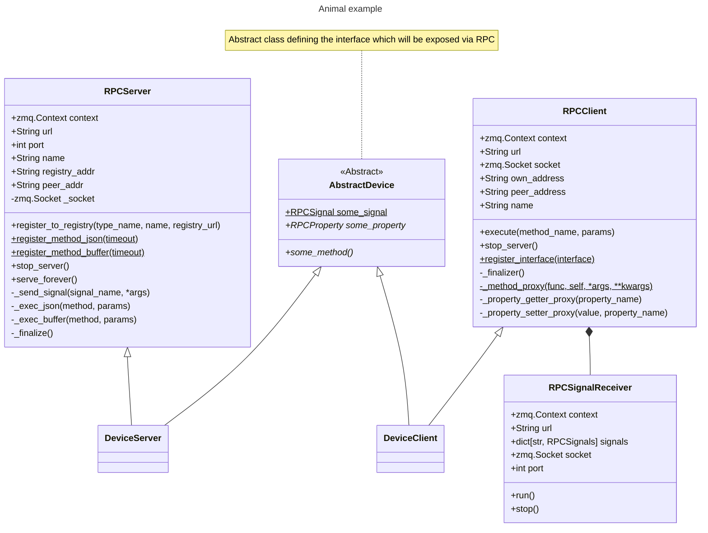
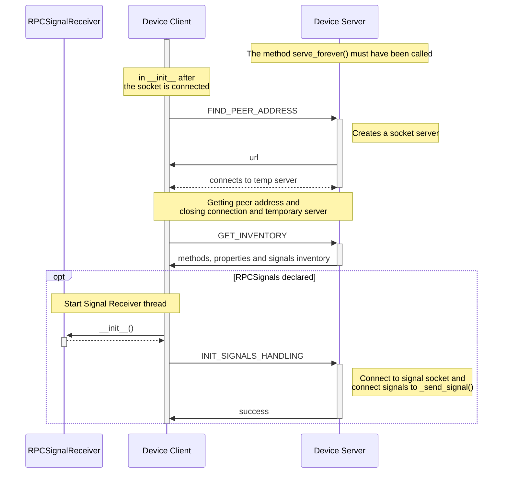
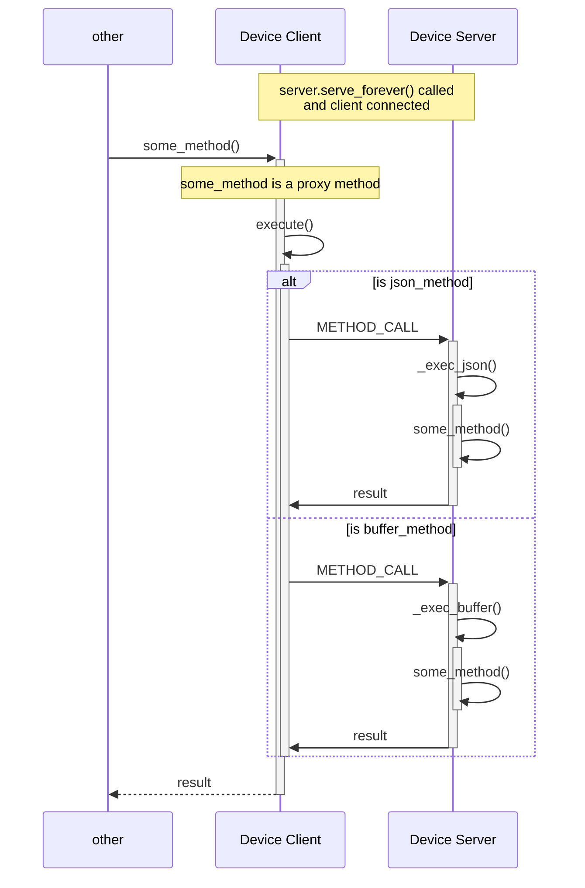
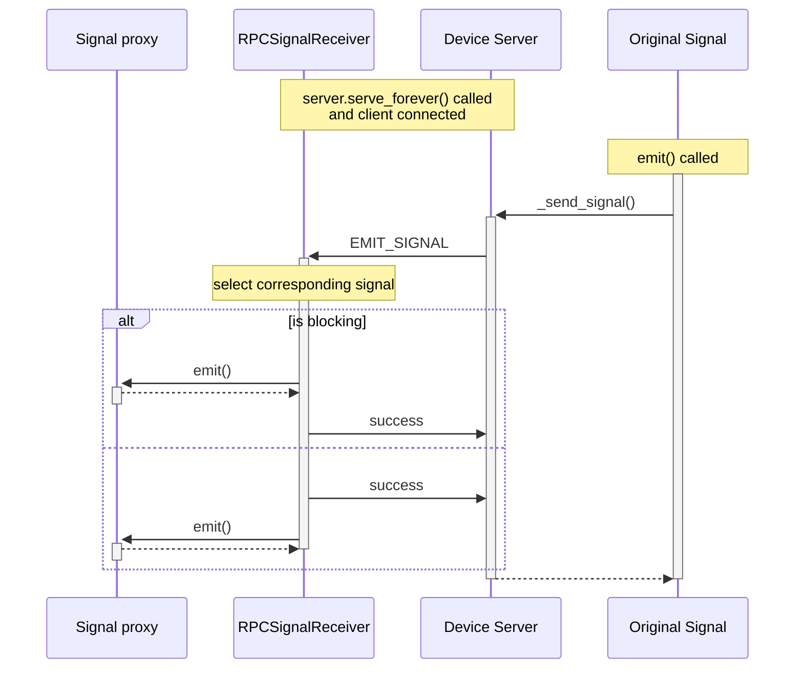
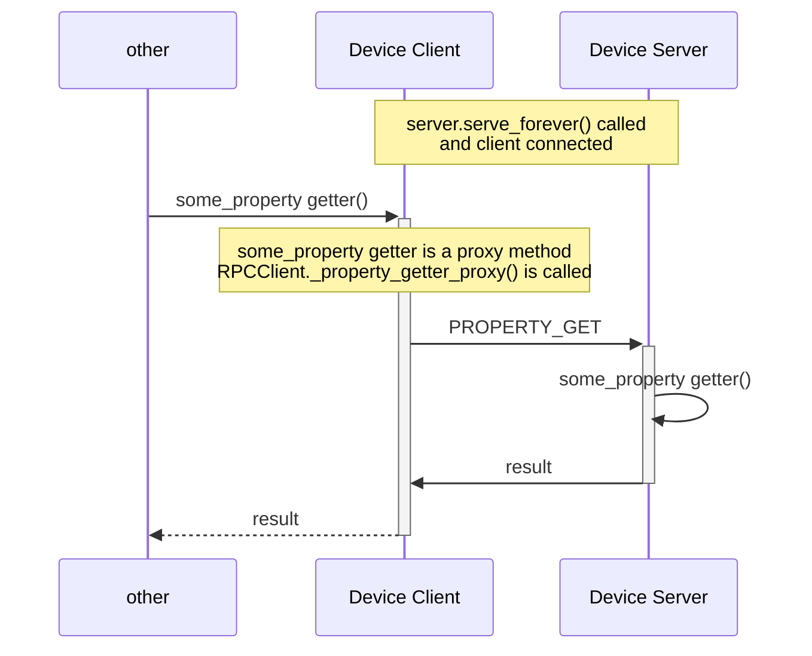
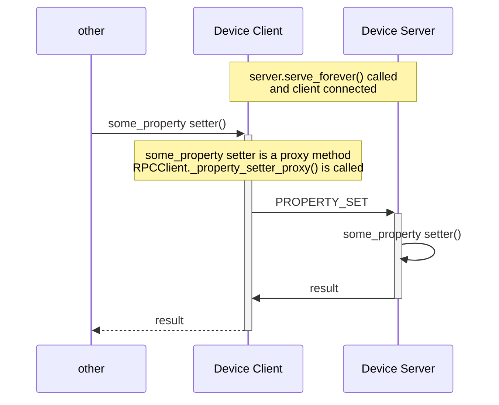

# RPC Communication

## Overview
RPC or Remote Procedure Call is a communication pattern between a client and a server where the client can access an 
object provided by the server as if it was a local object. In a sense, the client serves as a proxy of an object and 
the server makes the actual object available.

In Plant-Imager3 this communication protocol is implemented in the module `plantimager.commons.RPC` with the main two 
classes `RPCClient` and `RPCServer` as well as other auxiliary classes `RPCSignal`, `RPCProperty` and `RPCSignalReceiver`.

 - `RPCServer`: When used as a parent to a class, makes that class available as an RPC object
 - `RPCClient`: Proxy of an RPC object which connects to the `RPCServer` providing said object
 - `RPCSignal`: Declare signals for RPC objects which when emitted server-side are also emitted client-side, calling any connected method
 - `RPCProperty`: Declare python-style properties that are made available to the client
 - `RPCSignalReceiver`: Internal signal receiver client-side in charge of receiving and copying signals from the server

## Communication diagram

### Class diagram

Class diagram for a typical implementation where we want to make available te class `AbstractDevice`. To that end we
implement `DeviceServer` which inherits from both `AbstractDevice` and `RPCServer` and in which we implement the various
methods defined in the abstract class; `DeviceServer` will serve the implementation.

Client-side we simply declare a class `DeviceClient`inheriting from both `AbstractDevice` and `RPCClient` and which must
be decorated with the classmethod `RPCClient.register_interface()`. Implementation of the abstract methods of `AbstractDevice`
is automatically handled, creating proxy methods which will call the proper methods from `DeviceServer`.

### Connection diagram

### Method call

### Emitting a signal

### Property getter

### Property setter

