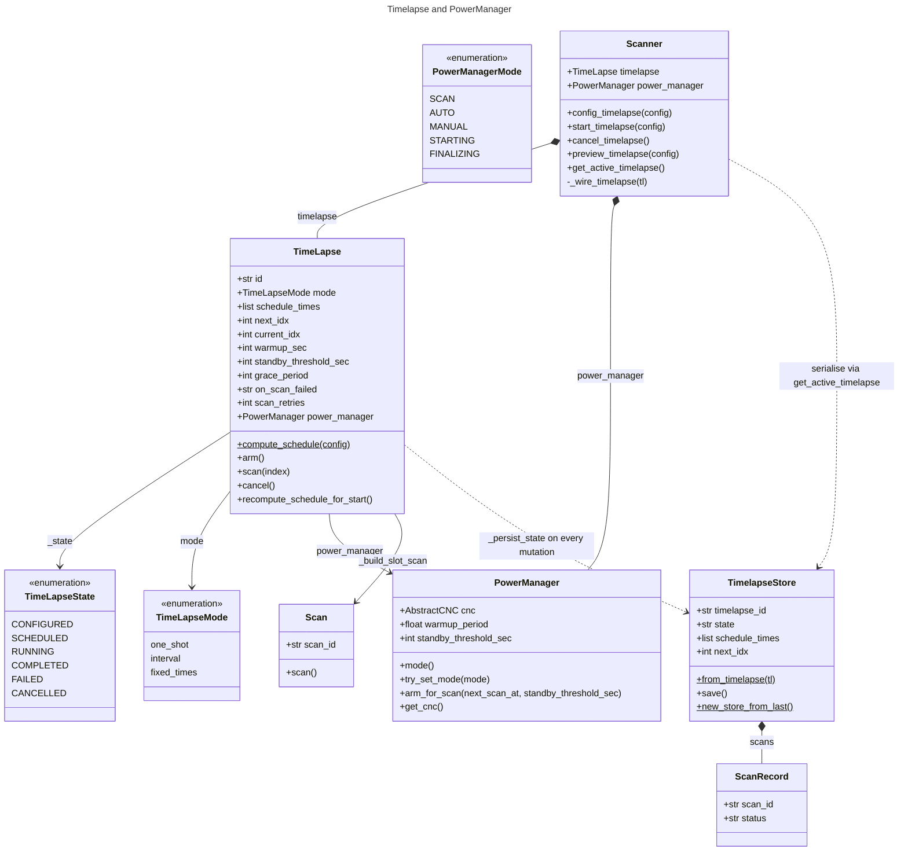
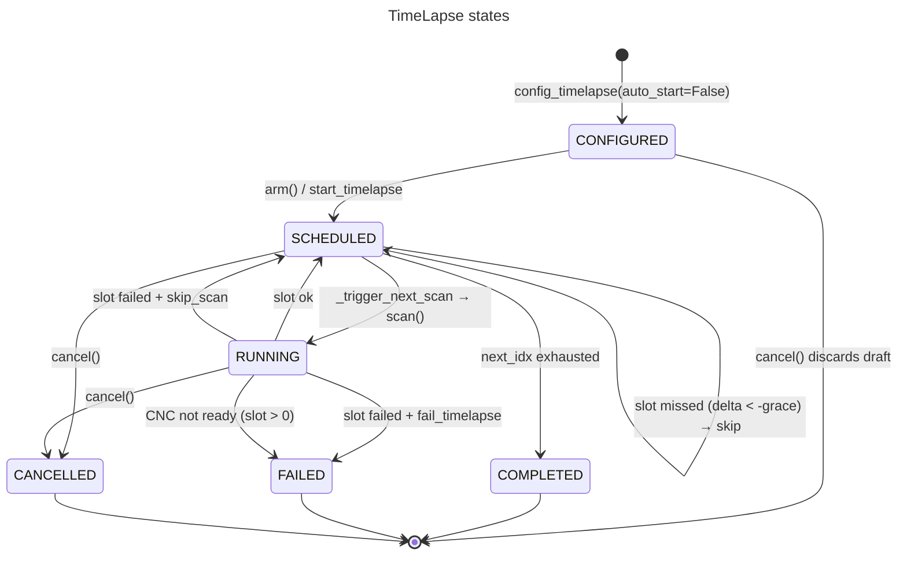
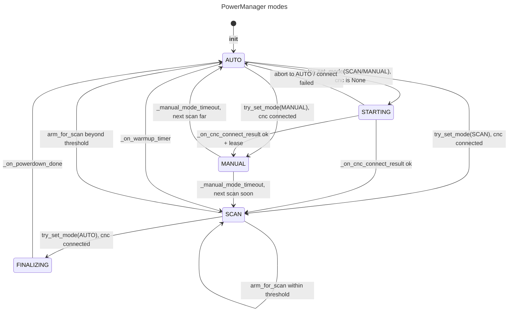
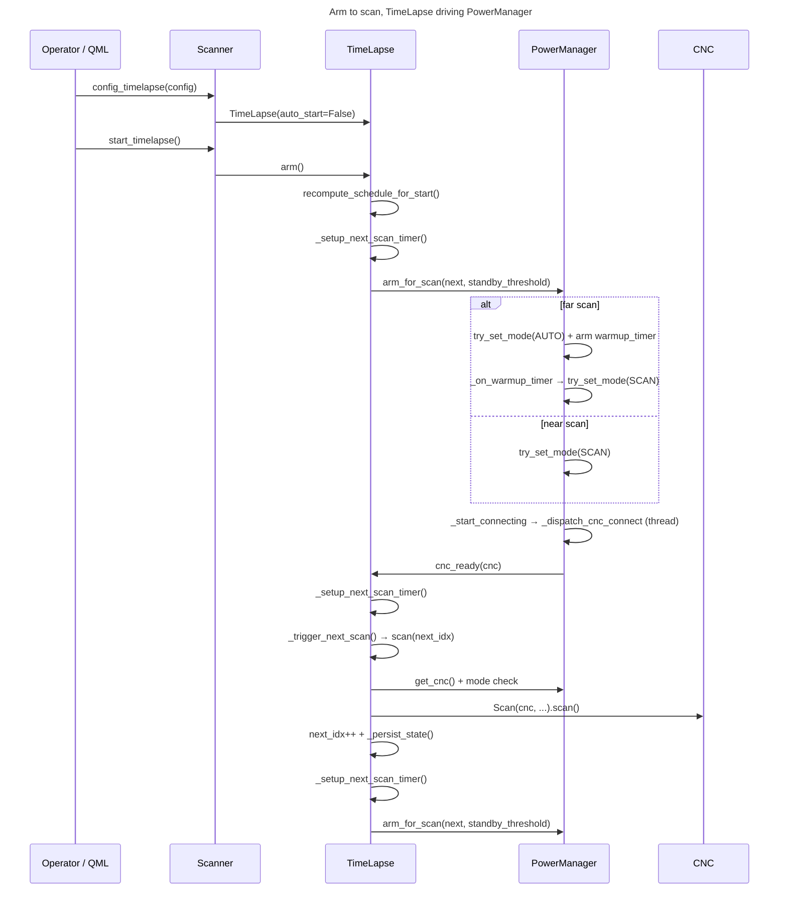
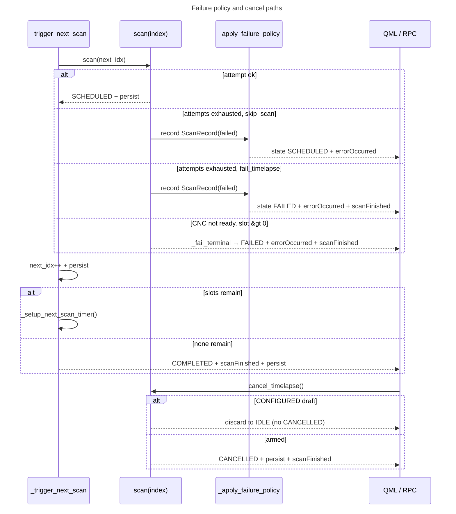

# Timelapse & PowerManager

Keywords: `TimeLapse`, `PowerManager`, `TimeLapseState`, `PowerManagerMode`, `arm_for_scan`, `cnc_ready`, `QTimer`, signals/slots, `Scanner`, `TimelapseStore`, `TimelapsePanel.qml`

## Overview

`TimeLapse` (`src/controller/plantimager/controller/scanner/timelapse.py:183`) schedules and runs a sequence of scans at computed UTC times. `PowerManager` (`src/controller/plantimager/controller/scanner/powermanager.py:102`) owns all power policy: it decides whether the rig stays powered or drops to idle between scans, and it owns the CNC connection lifecycle.

The coupling direction is fixed:

- `TimeLapse` **drives** `PowerManager` via plain method calls (`arm_for_scan`, `get_cnc`, `try_set_mode`, `mode` reads).
- `PowerManager` **notifies** `TimeLapse` via a single Qt signal/slot (`cnc_ready` → `TimeLapse.cnc_ready`).

Neither class uses `QStateMachine`. Both are enum-plus-property state holders (`TimeLapseState`, `PowerManagerMode`) with `QTimer`-driven transitions and Qt signals for QML/RPC propagation. Entry point is `Scanner` (`src/controller/plantimager/controller/scanner/scanner.py:552`), which constructs, wires, and forwards signals to QML (`TimelapsePanel.qml`) and RPC (`rpc_controller.py:216`).

PlantDB context (brief): a multi-scan job also creates a PlantDB timelapse container holding per-scan metadata (`timelapse.json` marker, `metadata.timelapse={id,index,scheduled}`). That storage layout is documented elsewhere; see `See Also` below. This page covers the controller-side scheduler and power policy only.

## Class diagram

`ControllerDevice` (`src/commons`) exposes `config/start/get_active/cancel/preview_timelapse` over RPC; `RPCControllerServer` (`rpc_controller.py:216-251`) delegates each call straight to `Scanner`. QML never touches `TimeLapse` directly: `TimelapsePanel.qml:102-109` connects to the `Scanner` bridge signals and polls `scanner.get_active_timelapse()` for the schedule table.

## TimeLapse state machine

States (`timelapse.py:175-181`): `CONFIGURED` (in-memory draft, never persisted as armed, never arms power), `SCHEDULED` (waiting for next slot), `RUNNING` (a `Scan.scan()` is executing), `COMPLETED` / `FAILED` / `CANCELLED` (terminal). There is no persisted `IDLE`: absence of a `TimelapseStore` file means no job. `CONFIGURED` is intentionally not persisted as runnable state; `cancel()` on a draft discards it without emitting `CANCELLED` (`scanner.py:654-671`).

Schedule computation (`compute_schedule`, `timelapse.py:269-359`, pure static, also used by `preview_timelapse` without constructing anything):

| `mode` | Schedule | Notes |
|---|---|---|
| `one_shot` | `[now + warmup_sec]` (or `[now]` for GRBL) | Single bare scan; no PlantDB container (`plantdb_timelapse_id = None`, `timelapse.py:399-402`). |
| `interval` | `[start + k*interval for k in n_shots]`, `interval` is seconds or `"2d-3h-1m-0s"` via `parse_duration` | `start = now + warmup_sec` (skipped for GRBL). Recomputed at arm time for drafts (`recompute_schedule_for_start`, `timelapse.py:408`). |
| `fixed_times` | Sorted parsed ISO datetimes, naive values read as host-local then converted to UTC | Absolute; never recomputed on arm. |

Guards applied in `_setup_timelapse_settings` (`timelapse.py:361-402`): `warmup_sec >= MIN_WARMUP_SEC` (default floor 45 s), `standby_threshold_sec >= STANDBY_WARMUP_FACTOR * warmup_sec` (default factor 2), `grace_period` default 120 s, `on_scan_failed ∈ {skip_scan, fail_timelapse}`, `scan_retries >= 0`.

Slot execution (`scan(index)`, `timelapse.py:431-514`):

1. `delta = scheduled - now(UTC)`. `delta > grace_period` → re-arm, return (never sleeps). `delta <= -grace_period` → late skip, persist, return.
2. Slot 0 with CNC not ready → defer to scheduler without consuming a retry (`timelapse.py:476-482`). Any later slot with CNC not ready → `_fail_terminal` immediately (standby/warmup budget was insufficient or the link is broken).
3. Otherwise up to `scan_retries + 1` immediate attempts via `_build_slot_scan` (fresh `Scan` per attempt, `scan_id = {plantdb_timelapse_id}_{index}` for multi-scan jobs, bare `id` otherwise). A retry is abandoned early when the next slot falls inside its grace window (`_slot_retry_allowed`, `timelapse.py:540`).
4. Exhaustion → `_apply_failure_policy` (`timelapse.py:550`): append a `ScanRecord(status="failed")`, then either `FAILED` + `errorOccurred` + `scanFinished` (`fail_timelapse`) or back to `SCHEDULED` + `errorOccurred` (`skip_scan`).

`_trigger_next_scan` (`timelapse.py:571`) wraps `scan()`, ignores its exceptions (skips do not raise), advances `next_idx`, persists, and either completes (`COMPLETED` + `scanFinished`) or re-arms. A `FAILED` state short-circuits before and after the call so a stray timer firing cannot overwrite the terminal state. Every state/`next_idx` mutation calls `_persist_state` → `TimelapseStore.from_timelapse(self).save()` (atomic `mkstemp` + `fsync` + `replace` under `~/.local/share/plant-imager3-app/`, `timelapse_store.py:115`).

## PowerManager state machine

Modes (`powermanager.py:95-100`): `SCAN` (rig powered, work lights on), `AUTO` (idle, growth lights on, CNC rail unpowered), `MANUAL` (operator hold, 5-minute lease), plus transients `STARTING` (rail powered, CNC connecting) and `FINALIZING` (parking + rail power-down). `mode` is a read-only Qt property (`@Property(str, notify=modeChanged)`, `powermanager.py:198`); all transitions go through `try_set_mode` → `_set_mode`.

Transition rules (`_set_mode`, `powermanager.py:206-243`): `MANUAL` is rejected from `SCAN`/`STARTING`; `STARTING` accepts only abort-to-`AUTO`; `FINALIZING` accepts nothing. Power-up (`_start_connecting`, `powermanager.py:250`) powers the rail, applies scan lights, and kicks `_dispatch_cnc_connect`. Power-down (`_start_powerdown`, `powermanager.py:306`) applies idle lights immediately but cuts rail power only after the blocking park finishes (`_do_powerdown_blocking` → `_powerdown_done` → `_on_powerdown_done`, which clears `cnc` and settles `AUTO`).

The single power-policy decision is `arm_for_scan(next_scan_at, standby_threshold_sec)` (`powermanager.py:385`), called by `TimeLapse` on every re-arm:

- `delta > standby_threshold_sec` → drop to `AUTO`, arm the internal `warmup_timer` for `next_scan_at - warmup_period`.
- `delta <= standby_threshold_sec` → stay/enter `SCAN`.

At policy level: far-apart scans idle the rig (growth lights, rail off) and warm it up just in time; dense scans keep it powered. Timing floors are `MIN_WARMUP_SEC` (default 45 s) and `STANDBY_WARMUP_FACTOR` (default 2×), overridable via `PI3_MIN_WARMUP_SEC` / `PI3_STANDBY_WARMUP_FACTOR` (`powermanager.py:58-69`). GPIO pins themselves are deployment detail (`GPIO_CNC_PIN` 17, `GPIO_LIGHTS_PIN` 27, `GPIO_GROWTH_LIGHTS_PIN` 22, overridable via env) and intentionally not expanded here.

## Sequence diagrams

### Steady-state cycle

`cnc_ready` re-arms unconditionally when non-terminal (`timelapse.py:603-608`): a late CNC connect simply recomputes the next firing. Note the `_next_scan_timer` here is the `TimeLapse`-owned single-shot; the `warmup_timer` is `PowerManager`-owned — the two timers are often confused, they are separate objects with separate owners.

### Failure, retry, and cancel

Signal emission order (`TimeLapse` state changes vs `PowerManager` mode changes) is pinned by `test/unit/controller/test_timelapse.py:679` (`test_signal_emission_order_timelapse_vs_power`).

## Timers

| Owner | Timer | Kind | Fires | Handler |
|---|---|---|---|---|
| `TimeLapse` (`timelapse.py:260`) | `_next_scan_timer` | `QTimer(singleShot=True)`, parented to `TimeLapse` | At `schedule_times[next_idx]`, or `0 ms` when inside grace, or `warmup_sec` for deferred slot 0 | `_trigger_next_scan` → `scan(next_idx)` → advance + re-arm. Stopped on `cancel()` / terminal states. Torn down via `destroyed` + `weakref.finalize`. |
| `PowerManager` (`powermanager.py:170`) | `manual_mode_timer` | `QTimer(singleShot=True, 5 min)` | 5 min after entering `MANUAL` (re-armed on CNC activity via `activity_monitor`) | `_manual_mode_timeout` → `AUTO` (scan far) or `SCAN` (scan soon). |
| `PowerManager` (`powermanager.py:172`) | `warmup_timer` | `QTimer(singleShot=True)` | At `next_scan_at - warmup_period`, armed by `arm_for_scan` | `_on_warmup_timer` → `try_set_mode(SCAN)`. Stopped and re-armed on every `arm_for_scan`. |
| `PowerManager` (`powermanager.py:174`) | `cnc_connect_timer` | `QTimer(singleShot=False, 1200 ms)`, started in `__init__` | Every 1.2 s while `STARTING` | `_dispatch_cnc_connect` → worker thread → `_cnc_result_signal` → `_on_cnc_connect_result`. Skipped unless `STARTING`, guarded against concurrent attempts. |

## Signals and slots

### `TimeLapse` (`timelapse.py:209-214`)

| Signal | Emitted when | Bridged to (via `Scanner._wire_timelapse`, `scanner.py:631-637`) |
|---|---|---|
| `stateChanged(str)` | Every `state` setter change (`timelapse.py:764-770`) | `Scanner.timelapseStateChanged` → QML `onTimelapseStateChanged` → `refreshTl()` |
| `progressChanged(int, int)` | `current_idx` / path length (`scan`, `__init__`) | `Scanner._on_timelapse_progress` → `timelapseProgressChanged` → QML progress bar |
| `errorOccurred(str)` | Exhausted slot, terminal failure (`_apply_failure_policy`, `_fail_terminal`) | `Scanner.timelapseErrorOccurred` → QML `onTimelapseErrorOccurred` |
| `scanFinished()` | `COMPLETED`, `FAILED`, `CANCELLED` | `Scanner._on_timelapse_finished` → QML `onTimelapseFinished` |
| `scanCreated(object)` | Each fresh per-attempt `Scan` (`scan`, `timelapse.py:502`) | `Scanner._bridge_scan_signals` — fans the inner scan's progress into the UI |
| `pathInfoChanged(str)` | Path constructed (`__init__`) | QML path label via `path_info` property |

`state` and `path_info`/`progress`/`max_progress` are Qt properties (`@Property(..., notify=...)`, `timelapse.py:727-778`) so QML binds to them directly.

### `PowerManager` (`powermanager.py:105-108`)

| Signal | Emitted when | Connected to |
|---|---|---|
| `cnc_ready(object)` | CNC connected, stable mode committed (`_on_cnc_connect_result`, `powermanager.py:303`) | `TimeLapse.cnc_ready` (`@Slot(object)`, `timelapse.py:603`) — re-arms schedule. Connect this in the owner (`Scanner` or test harness), not inside either class. |
| `modeChanged(str)` | Every `_set_stable` / `STARTING` / `FINALIZING` entry | QML badge (`Scanner.qml` shows power mode alongside timelapse state), RPC observers |
| `_cnc_result_signal(object)` | Worker thread → main thread bridge (`_do_cnc_connect_blocking`) | `_on_cnc_connect_result` (same object) — never connect externally |
| `_powerdown_done()` | Blocking park finished (`_do_powerdown_blocking`) | `_on_powerdown_done` (same object) — never connect externally |

Stale-connect guard (`powermanager.py:286-295`): a result arriving after abort-to-`AUTO` frees its own serial port via `cnc.stop()` and never touches the shared GPIO rail pin — rail power is owned solely by the mode transitions.

### Cross-object call matrix (maintainer reference)

| Caller | Callee | Where |
|---|---|---|
| `TimeLapse._setup_next_scan_timer` | `PowerManager.arm_for_scan` | `timelapse.py:703` — the only direct power-policy call |
| `TimeLapse.__init__ / _setup_timelapse_settings / recompute_schedule_for_start / _build_slot_scan / _cnc_ready / scan` | `PowerManager.get_cnc` | Read-only handle fetch for `Scan` construction and readiness checks |
| `TimeLapse` (slot-0 defer path) | `PowerManager.arm_for_scan` | `timelapse.py:688` — wake-at `now + warmup_sec` |
| `TimeLapse` guards | `PowerManager.mode` | `_cnc_ready` requires `SCAN`/`MANUAL` (`timelapse.py:610-614`) |
| `PowerManager` | `TimeLapse` | None — reverse path is the `cnc_ready` signal only |
| `Scanner` | both | Constructs with shared `power_manager` (`scanner.py:535-544`, `607-615`); `_wire_timelapse` connects the five fan-out signals (`scanner.py:631-637`); `preview_timelapse` calls `compute_schedule` without constructing (`scanner.py:673-683`) |
| `RPCControllerServer` | `Scanner` | `config/start/get_active/cancel/preview_timelapse` (`rpc_controller.py:216-251`) |
| QML | `Scanner` | `get_active_timelapse()` snapshot + bridge signals (`TimelapsePanel.qml:80-109`); panel is poll-on-signal, not bound to live objects |

## Configuration reference

`config["timelapse"]` keys (`_setup_timelapse_settings`, `timelapse.py:361-390`):

| Key | Default | Meaning |
|---|---|---|
| `mode` | required | `one_shot` / `interval` / `fixed_times` |
| `interval` | required for `interval` | Seconds (`int`) or duration string (`"1h30m"`, `parse_duration`) |
| `n_shots` | required for `interval` | Slot count |
| `dates` | required for `fixed_times` | ISO-8601 list, sorted; naive read as host-local → UTC |
| `warmup_period` | `30` (floored to `MIN_WARMUP_SEC`) | Seconds before first scan; ignored for `fixed_times` and GRBL |
| `standby_threshold_sec` | `600` (floored to `STANDBY_WARMUP_FACTOR × warmup_sec`) | Stay-powered cutoff passed to `arm_for_scan` |
| `grace_period` | `120` | Late-start acceptance window (s); also the immediate-dispatch threshold |
| `light_policy` | `{}` | Stored on the job; light actuation itself follows the mode (policy level) |
| `on_scan_failed` | `skip_scan` | `skip_scan` records and continues; `fail_timelapse` ends `FAILED` |
| `scan_retries` | `0` | Per-slot immediate re-attempts, abandoned when the next slot is inside grace |

## Persistence and recovery

`TimelapseStore` (`timelapse_store.py:73-261`) persists `timelapse_id/mode/state/schedule_times/next_idx/current_idx`, the four timing/policy fields, and thin `ScanRecord`s (never whole `Scan` objects) to `~/.local/share/plant-imager3-app/timelapse_storage.json` (override `PI3_TIMELAPSE_FILE_NAME`). Saves are atomic (`mkstemp` in the same directory + `fsync` + `replace`). `get_active_timelapse` serialises the same shape for QML/RPC (`scanner.py:639-652`). Resume path: `new_store_from_last()` → `to_timelapse_kwargs()` with best-effort version tolerance.

## See Also

- `RPC.md` — RPC signal/property bridging used by `timelapseChanged`-style fan-out
- `architecture.md` — controller component layout
- PlantDB timelapse storage (`timelapse.json` container, `metadata.timelapse`) — server-side docs
- Sources: `timelapse.py:1-67` (module call-graph header), `powermanager.py:1-69` (timing floors), `scanner.py:516-689`, `timelapse_store.py`, `TimelapsePanel.qml:1-120`, `test/unit/controller/test_timelapse.py`, `test/unit/controller/test_powermanager.py`, `test/integration/test_timelapse_integration.py`
