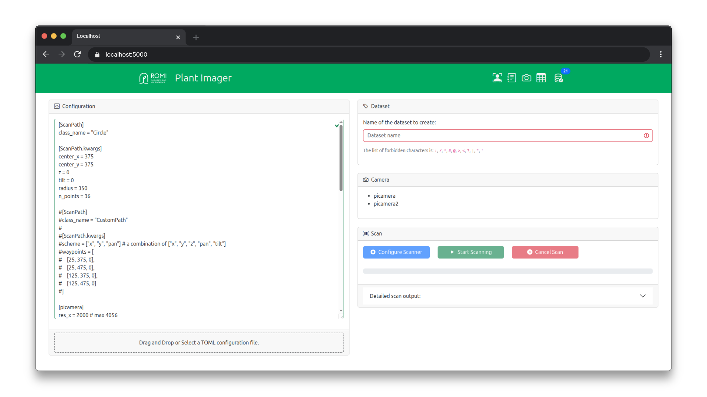

# [](https://romi-project.eu) / plantimager.webui

[](https://www.gnu.org/licenses/lgpl-3.0.en.html)
[]()

A Dash-based Python package providing a web-based user interface for plant scanning.
It is intended to run on the main controller (Raspberry Pi 4 or 5) or as a Docker container in a remote server.



## Environment Setup

We strongly recommend using isolated environments to install ROMI libraries.

This documentation uses `conda` as both an environment and package manager.
If you don't have `miniconda3` installed, please refer to the [official documentation](https://docs.conda.io/en/latest/miniconda.html).

To create a new conda environment, named `plant-imager3`, with Python3.11 & IPython:
``` shell
conda create -n plant-imager3 'python==3.11' ipython
```


## Installation

### Developer - Installing from Source Code

If you are a developer and need to work on the source code or make modifications, follow these steps:
1. **Activate your environment:** First, activate your conda environment:
    ``` shell
    conda activate plant-imager3  # Make sure your development environment is activated!
    ```
2. **Install from sources:** Install the package directly from the source directory using pip:
    ``` shell
    python -m pip install src/webui
    ```
This method allows you to work on the code and test changes locally before committing them.

### User - Installing via pip Package

For regular users who just need to use the application without modifying the source code, follow these steps:
1. **Activate your environment:** First, activate your conda environment:
    ``` shell
    conda activate plant-imager3  # Make sure your user environment is activated!
    ```
2. **Install via pip:** Install the package using pip from the Python Package Index (PyPI):
    ``` shell
    pip install plantimager.webui
    ```
This method installs a pre-built version of the application, making it quick and easy to set up.


## Usage

### Development

To run the app in development mode, you have two options:
1. **Using the command-line interface:** You can simply run the following command:
    ``` shell
    plant-imager-webui
    ```
2. **From the root directory of the repository:** If you prefer to run the app directly from the source code, navigate to the root directory of the repository and execute:
    ``` shell
    python src/webui/plantimager/webui/app.py
    ```

Both methods will start the Dash-based web application in development mode, which includes features like automatic code reloading and detailed error messages, making it easier to develop and test your application efficiently.

### Production

#### Environment variable

Here is the list of environment variables you can define:

- `ALLOW_PRIVATE_IP`: if `True`, allow the use of private IPs for PlantDB REST API URL
- `CERT_PATH`: specify the path to the self-signed certificates used by the PlantDB server.
- `VALIDATE_HOST`: if `True`, check the PlantDB REST API URL against a blacklist
- `P3DX_URL`: to be able to open plants from the table in the P3DX, default to http://127.0.0.1:5050

The app makes use of `dotenv.load_dotenv` so you can define them in a `.env` file located in the same directory as the `app.py` file.
It should be under `src/webui/plantimager/webui`.

> If you are running the WebUI on a different machine than the NGINX server is running to serve the PlantDB and want to use SSL, do not forget to copy the (self-signed) certificate and reference them with the `CERT_PATH` env var. 

#### Running with uWSGI
`uWSGI` is a fast, self-healing, and extensively configurable application server that can serve Python applications.
It provides various features such as load balancing, process management, and more, making it well-suited for running web applications in a production environment.

To run the Dash app in production mode, you need to install `uwsgi`:
```shell
pip install uwsgi
```

Start the application with uWSGI using the following command:
```shell
uwsgi --http :8080 --module plantimager.webui.wsgi:application --callable application --master
```

Key parameters explained:
- `--http :8080`: Bind to port 8080 and handle HTTP requests directly
- `--module plantimager.webui.wsgi:application`: Path to the WSGI module and application object
- `--callable application`: Specify the WSGI callable name (application is the standard name)
- `--master`: Enable master process mode for better resource management and reliability

#### Additional Production Settings

For improved performance in production, consider these additional options:
```shell
uwsgi --http :8080 --module plantimager.webui.wsgi:application --callable application --master --processes 4 --threads 2 --thunder-lock
```

- `--processes 4`: Run 4 worker processes to handle requests in parallel
- `--threads 2`: Use 2 threads per worker process for additional concurrency
- `--thunder-lock`: Use a more efficient lock mechanism for multi-process deployments


## Docker

### Build Image
To build the `roboticsmicrofarms/plantimager_webui` docker image, you may use the convenience `build.sh` script.
This will create a Docker image with everything needed to run the web UI.

1. Open your terminal.
2. Run the following command:
   ```shell
   ./docker/webui/build.sh -t latest
   ```

This command uses the build script located in the `./docker/webui/` directory to create the Docker image and tags it as "latest".

### Start a Container

Once you've built the Docker image, you can run it as a container. This will start the web UI application.

1. Open your terminal.
2. Run the following command:
   ```shell
   docker run -it --rm --name plantimager_webui -p 8080:8080 roboticsmicrofarms/plantimager_webui:latest "uwsgi --http :8080 --module plantimager.webui.wsgi:application --callable application --master  --processes 4 --threads 2 --thunder-lock"
   ```

Let's break down what this command does:
- `docker run`: This starts a new Docker container.
- `-it`: This runs the container in interactive mode with a terminal attached.
- `--rm`: This automatically removes the container when it stops.
- `--name plantimager_webui`: This gives your container a name, making it easier to manage.
- `-p 8080:8080`: This maps port 8080 on your local machine to port 8080 in the Docker container, so you can access the web UI.
- `roboticsmicrofarms/plantimager_webui:latest`: This specifies which Docker image to use (the one we built earlier).
- `"uwsgi --http :8080 --module plantimager.webui.wsgi:application --callable application --master"`: These are the parameters that start the web server inside the container.

After running this command, you should be able to access the web UI by opening your browser and navigating to `http://localhost:8080/webui`.

If you encounter any issues or need further assistance, please refer to the [Docker documentation](https://docs.docker.com/) for more details.
